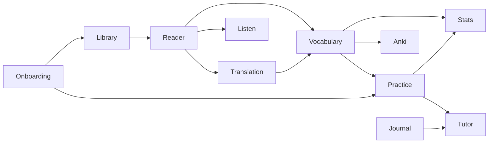
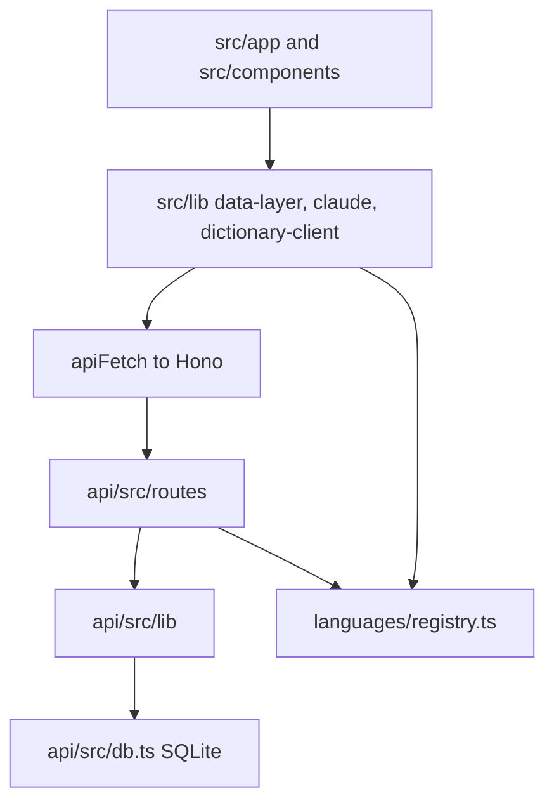

# Flow maps

The walkable graph is the map of critical paths. Open `docs/flows/index.html` in a browser.

```bash
cd docs/flows
python3 -m http.server 8766
```

Then open http://localhost:8766/. You can also open `index.html` as a file.

Stand on a node. The left list shows neighbors. The graph in the centre shows the same set. Click a neighbor to walk. The trail at the top is the walk so far.

Search jumps to a node. A flow with a happy path has Start walk. That walk follows the main call chain.

Each node names the app domain, the key files, the key functions, the HTTP route, and the SQLite tables.

The maps do not replace the code. Read the files that a node lists.

If you change a listed path, update `graph-data.js` and the `.md` notes for that path in the same change. Then run:

```bash
node docs/flows/validate-graph.mjs
```

## App domains

An **app domain** is a product area. It is not a topic domain on the fluency radar.

Onboarding is the product name for first-run setup.

Topic domains live in `api/src/lib/domains.ts`. They tag known words as `food`, `travel`, and similar axes. Do not mix the two names.



| App domain | What it covers | Map |
| --- | --- | --- |
| Library | Collections, lessons, and import | [library.md](library.md) |
| Translation | Word tap, gloss, and In-context action | [translation.md](translation.md) |
| Vocabulary | Saved entries, word states, and known-word import | [vocabulary.md](vocabulary.md) |
| Practice | Cloze, dictation, and review | [practice.md](practice.md) |
| Journal | Draft and correction | [journal.md](journal.md) |
| Tutor | Chat widget and cloze Explain | [tutor.md](tutor.md) |
| Listen | Speech, podcast audio, and YouTube captions | [listen.md](listen.md) |
| Anki | Card push and review sync | [anki.md](anki.md) |
| Onboarding | Setup, starter texts, and first cloze | [onboarding.md](onboarding.md) |
| Stats | Daily counts, streaks, and fluency radar | [stats.md](stats.md) |

## Layers

Every flow uses the same layers, in this order.

1. A React page or component in `src/`.
2. A client helper in `src/lib/`. Most persistence goes through `src/lib/data-layer.ts`.
3. An HTTP call to the Hono API. The browser talks to the API directly. There is no Next.js proxy.
4. A route module under `api/src/routes/`. The mount table is `api/src/routes/registry.ts`.
5. Library code under `api/src/lib/` and SQLite in `api/src/db.ts`.

Language rules live in `languages/`. The client and the API both import `languages/registry.ts`.

Route handlers are anonymous `app.get` and `app.post` callbacks. The tables name the file and the path.



## Shared files

| Role | Path |
| --- | --- |
| Client HTTP | `src/lib/api-base.ts` (`apiFetch`, `apiUrl`) |
| Client persistence | `src/lib/data-layer.ts` |
| Client types | `src/types/index.ts` |
| API mount table | `api/src/routes/registry.ts` |
| SQLite schema | `api/src/db.ts` |
| Language registry | `languages/registry.ts` |
| Entitlements | `api/src/lib/entitlements.ts` |
| LLM providers | `api/src/lib/llm/index.ts` (`getProvider`) |

Active language is a query parameter on most list calls. By-id lesson and journal calls can omit it. The API then uses `resolveLanguage` in `api/src/lib/active-language.ts`.

## Other surfaces

These are not study flows. Key files:

| Surface | Client | API |
| --- | --- | --- |
| Auth | `src/lib/auth-client.ts`, `src/app/(auth)/` | `/api/auth/*` in `api/src/index.ts` |
| Data takeout | `src/app/settings/components/DataManagement/` | `api/src/routes/data.ts` |
| Billing | `src/app/settings/components/CloudPlanSettings.tsx` | `api/src/routes/billing.ts` |
| Settings for the large language model (LLM) | `src/app/settings/components/LLMSettings/` | `api/src/lib/llm/` |

## Flow index

| Flow | App domain | Map |
| --- | --- | --- |
| Load library item | Library | [library.md](library.md#load-library-item) |
| Import EPUB, paste, URL, YouTube, audio | Library | [library.md](library.md#import) |
| Translate word | Translation | [translation.md](translation.md#translate-word) |
| In-context translation | Translation | [translation.md](translation.md#in-context-translation) |
| Phrase selection | Translation | [translation.md](translation.md#phrase-selection) |
| Enrich and nested lookup | Translation | [translation.md](translation.md#enrich-and-nested-lookup) |
| Cache accepted translation | Translation | [translation.md](translation.md#cache-accepted-translation) |
| Save vocab and set word state | Vocabulary | [vocabulary.md](vocabulary.md#save-vocab-and-set-word-state) |
| Vocab list | Vocabulary | [vocabulary.md](vocabulary.md#vocab-list) |
| Known-word import | Vocabulary | [vocabulary.md](vocabulary.md#known-word-import) |
| Practice word | Practice | [practice.md](practice.md#practice-word) |
| Dictation | Practice | [practice.md](practice.md#dictation) |
| Blacklist sentence | Practice | [practice.md](practice.md#blacklist-sentence) |
| Submit journal for correction | Journal | [journal.md](journal.md#submit-journal-for-correction) |
| Save journal draft | Journal | [journal.md](journal.md#save-journal-draft) |
| Tutor chat | Tutor | [tutor.md](tutor.md#tutor-chat) |
| Cloze Explain | Tutor | [tutor.md](tutor.md#cloze-explain) |
| Speak word | Listen | [listen.md](listen.md#speak-word) |
| Listen-along | Listen | [listen.md](listen.md#listen-along) |
| Push to Anki | Anki | [anki.md](anki.md#push-to-anki) |
| Sync Anki reviews | Anki | [anki.md](anki.md#sync-anki-reviews) |
| Language setup | Onboarding | [onboarding.md](onboarding.md#language-setup) |
| Daily stats and fluency | Stats | [stats.md](stats.md) |
