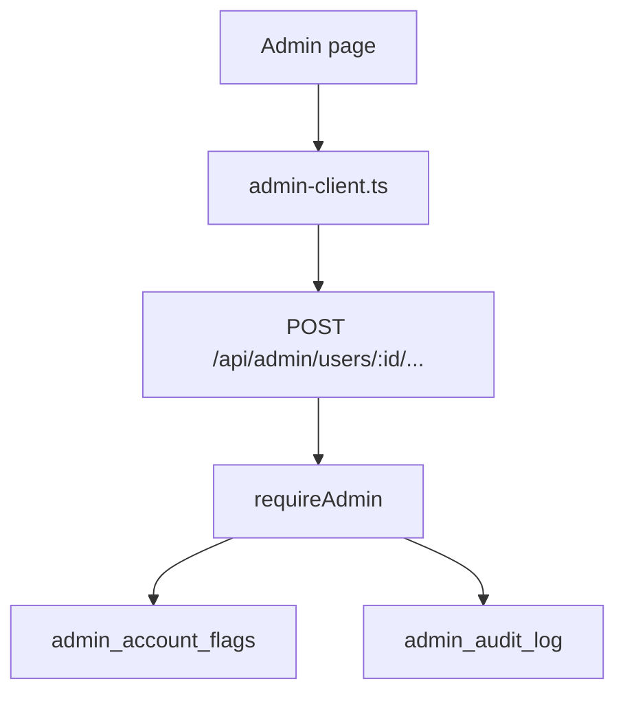

# Admin domain

Admin is the operator dashboard. It exists in cloud mode only. `requireAdmin` gates every `/api/admin` route.

## Admin member list

**App domain:** Admin

The admin page loads a summary and a member list.

| Role | Path | Function |
| --- | --- | --- |
| Page | `src/app/admin/page.tsx` | Admin page |
| Client | `src/lib/admin-client.ts` | `getAdminSummary`, `getAdminUsers`, `getAuditLog` |
| API | `api/src/routes/admin.ts` | `GET /summary`, `GET /users`, `GET /audit` |
| Gate | `api/src/lib/admin.ts` | `makeRequireAdmin`, `isAdmin` |

`LECTOR_ADMIN_EMAILS` is the allow list. A non-admin gets 403.

Each row shows plan, status, last active, library size, and month usage.

## Admin support action

**App domain:** Admin

Each support write hits the audit log.

| Action | Client | Route |
| --- | --- | --- |
| Suspend | `suspendUser` | `POST /users/:id/suspend` |
| Restore | `restoreUser` | `POST /users/:id/restore` |
| Comp | `compUser` | `POST /users/:id/comp` |
| Uncomp | `uncompUser` | `POST /users/:id/uncomp` |
| Export | `exportUser` | `GET /users/:id/export` |
| Reset MFA | `resetMfa` | `POST /users/:id/reset-mfa` |
| Password reset | `sendPasswordReset` | `POST /users/:id/password-reset` |
| Resend confirmation | `resendVerification` | `POST /users/:id/resend-verification` |
| Force confirmation | `forceVerify` | `POST /users/:id/verify` |
| Revoke sessions | `revokeSessions` | `POST /users/:id/revoke-sessions` |
| Resync Paddle | `resyncPaddle` | `POST /users/:id/resync-paddle` |

Export uses `buildUserExport`. See [Data](data.md).

Comp writes a flag. It does not create a Paddle row. The entitlements engine treats the flag as a paid plan.

## Impersonate

**App domain:** Admin

The operator acts as a member. Ordinary API routes then serve the target tenant.

| Role | Path | Function |
| --- | --- | --- |
| Client | `src/lib/admin-client.ts` | `startImpersonation`, `stopImpersonation`, `getImpersonationStatus` |
| Start | `api/src/routes/admin.ts` | `POST /users/:id/impersonate` |
| Stop | `api/src/routes/admin.ts` | `POST /impersonation/stop` |
| Status | `api/src/routes/impersonation.ts` | `GET /status` |
| Grant | `api/src/lib/impersonation.ts` | `startImpersonation`, `stopImpersonation` |
| Banner | `src/components/ImpersonationBanner/index.tsx` | ImpersonationBanner |

AuthGuard namespaces client caches under the target user id. A stop returns the operator to the operator tenant.

### Tables

`admin_account_flags`, `admin_audit_log`, `admin_impersonation`.
