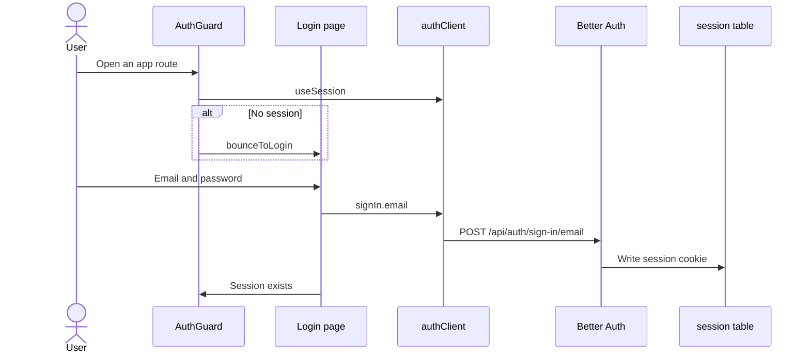
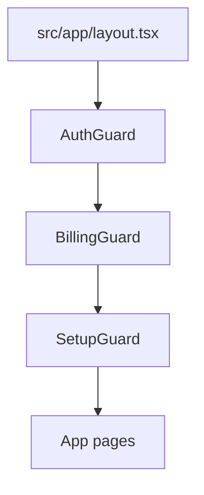

# Auth domain

Auth is the cloud session gate. Selfhost skips this domain. The root layout mounts AuthGuard first.

## Sign in

**App domain:** Auth

### Key files

| Role | Path | Function |
| --- | --- | --- |
| Gate | `src/components/AuthGuard/index.tsx` | `AuthGuard`, `CloudSessionGate` |
| Login | `src/app/(auth)/login/page.tsx` | `handleSubmit` |
| Client | `src/lib/auth-client.ts` | `authClient` |
| Bounce | `src/lib/api-base.ts` | `bounceToLogin` |
| Engine | `api/src/lib/accounts.ts` | `createAuthEngine`, `getAuthEngine` |
| Mount | `api/src/index.ts` | `/api/auth/*` |

### Branches

- Selfhost never mounts `useSession`. The API has no `/api/auth/*` route.
- Auth pages render even with no session. They send a signed-in user to `/`.
- When `window.__ENV__` enables them, GitHub and OIDC buttons show.
- Turnstile is a one-use token. A failed submit remounts the widget.
- An unverified email stays on the login page. The user can ask for a new mail.

### Tables

Better Auth owns `user`, `session`, `account`, and `verification`. Lector study tables do not hold the session.

### Tests

`e2e/auth-cloud.spec.ts`, `e2e/auth-selfhost.spec.ts`.

## Sign up

**App domain:** Auth

The register page calls `authClient.signUp.email`. Better Auth sends a confirmation email. The account is not a session until the user opens the confirmation link.

| Role | Path | Function |
| --- | --- | --- |
| Register | `src/app/(auth)/register/page.tsx` | `handleSubmit` |
| Engine | `api/src/lib/accounts.ts` | `createAuthEngine` |

Reset password and two-factor live in `src/app/(auth)/reset-password/` and `src/app/(auth)/two-factor/`. They use the same Better Auth handler.

## Lifecycle email

**App domain:** Auth

Cloud sends each Resend template once. Self-host does not send these templates.

| Role | Path | Function |
| --- | --- | --- |
| Hook | `api/src/lib/accounts.ts` | `afterEmailVerification` |
| Rules | `api/src/lib/lifecycle-email.ts` | `sendWelcomeEmail`, `sweepLifecycleEmails` |
| Transport | `api/src/lib/email.ts` | `sendEmail` |
| Log | `api/src/db.ts` | `email_sends` |

### Send rules

- Welcome: the user confirms email. An OAuth user with a confirmed email gets this email on create. The sweep does not send welcome. If `RESEND_API_KEY` is absent when the user confirms, the send does not run. That send does not retry.
- Day 1: the account age is 24 hours to 72 hours. The user has no saved word.
- Day 3: the account age is 72 hours to 7 days. The user has no real use.
- The sweep skips an account older than 7 days. The sweep does not send welcome, Anki, or gloss-cap.
- Anki: the user has 10 saved words. Ignored words do not count.
- Gloss cap: a free-plan user reaches the monthly gloss limit.

Real use is a saved word, a learner event, or progress on a lesson above zero. A starter lesson with `lastReadAt` is not real use.

### Skip rules

The send does not run when:

- The app is not cloud.
- `RESEND_API_KEY` is absent.
- The user did not confirm the email.
- The user already has that template.
- The user asked to stop product emails.

If `EMAIL_UNSUB_SECRET` is set, stop-mail tokens use that secret. If it is absent, the tokens use `BETTER_AUTH_SECRET`. A check accepts both secrets.

The app sends `verify`, `reset`, and `delete` mails as plain text. A transport error does not fail signup or login.

`api/src/lib/lifecycle-email.test.ts` and `api/src/lib/email.test.ts` cover the rules.

## Session gate

**App domain:** Auth

The root layout order is AuthGuard, then BillingGuard, then SetupGuard.

- Cloud: AuthGuard waits for a session. BillingGuard waits for `accessAllowed`. SetupGuard waits for `targetLanguage`.
- Selfhost: AuthGuard and BillingGuard pass through. SetupGuard still runs.
- `apiFetch` treats 401 as `bounceToLogin` and 402 as `bounceToSubscribe`.
- Impersonation changes the tenant id inside AuthGuard. See [Admin](admin.md#impersonate).
