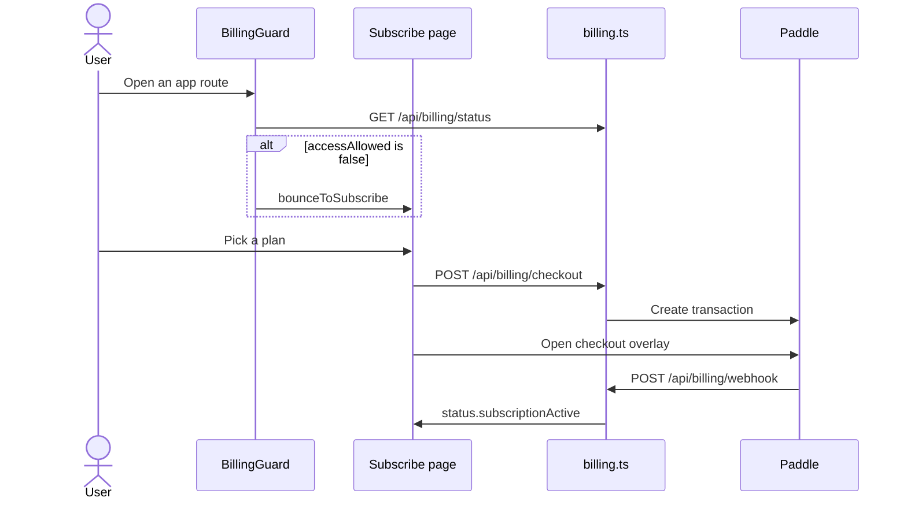

# Billing domain

Billing is the cloud plan gate. Selfhost skips this domain. The API enforces every paid limit. The client only reads status.

## Subscribe

**App domain:** Billing

BillingGuard sits between AuthGuard and SetupGuard. A locked account goes to `/subscribe`.

| Role | Path | Function |
| --- | --- | --- |
| Gate | `src/components/BillingGuard/index.tsx` | `BillingGuard`, `CloudBillingGate` |
| Page | `src/app/(auth)/subscribe/page.tsx` | Subscribe page |
| Client | `src/lib/billing.ts` | `fetchBillingStatus`, `startCheckout` |
| Bounce | `src/lib/api-base.ts` | `bounceToSubscribe` |
| API | `api/src/routes/billing.ts` | `GET /status`, `POST /checkout` |
| Mirror | `api/src/lib/billing.ts` | `applyPaddleEvent` |

### Branches

- Selfhost never bills. BillingGuard passes through.
- When the rollout flag is on, Free plan can enter the app. Checkout is still available.
- A failed status probe does not lock the UI. The API still returns 402 on gated calls.
- `apiFetch` treats any 402 as `bounceToSubscribe`.
- Entitlement waits for the webhook. A success return from Paddle is not enough.

## Entitlements

**App domain:** Billing

Routes call the entitlements engine before a metered write. The client only reads `GET /api/billing/entitlements`.

| Role | Path | Function |
| --- | --- | --- |
| Client | `src/lib/data-layer.ts` | `getEntitlements` |
| API | `api/src/routes/billing.ts` | `GET /entitlements` |
| Engine | `api/src/lib/entitlements.ts` | `entitlements` |

A 429 `{ error: 'plan_limit' }` is a soft cap. It is not a 402 lockout.

Selfhost and exempt emails resolve to the `unlimited` plan.

## Change plan

**App domain:** Billing

`CloudPlanSettings` previews proration, then posts the change.

| Role | Path | Function |
| --- | --- | --- |
| UI | `src/app/settings/components/CloudPlanSettings.tsx` | CloudPlanSettings |
| Client | `src/lib/billing.ts` | `previewPlanChange`, `applyPlanChange`, `createCustomerPortalSession` |
| API | `api/src/routes/billing.ts` | `POST /change/preview`, `POST /change`, `POST /portal` |

Entitlement still waits for the webhook.

### Tables

`billing_customers`, `billing_subscriptions`, `usage_counters`.
