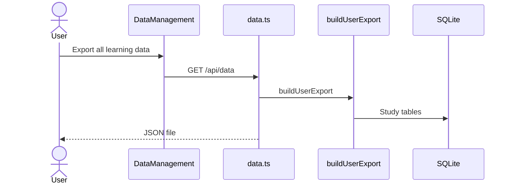

# Data domain

This domain exports and restores learning data. API keys and provider endpoints never leave the server.

## Export learning data

**App domain:** Data

The Settings card links to `GET /api/data`. The browser downloads JSON.

| Role | Path | Function |
| --- | --- | --- |
| UI | `src/app/settings/components/DataManagement/index.tsx` | DataManagement |
| Client | `src/lib/data-layer.ts` | `exportAllData` |
| API | `api/src/routes/data.ts` | `GET /` |
| Pack | `api/src/lib/user-export.ts` | `buildUserExport` |

The payload holds collections, lessons, vocab, known words, cloze, journal, and stats. It also holds settings that are not secrets.

Admin export of one member uses the same pack. See [Admin](admin.md).

## Restore learning data

**App domain:** Data

The user picks a JSON file. The client posts it to `POST /api/data`.

| Role | Path | Function |
| --- | --- | --- |
| UI | `src/app/settings/components/DataManagement/index.tsx` | `handleBackupImport` |
| Client | `src/lib/data-layer.ts` | `importFromDexie` |
| API | `api/src/routes/data.ts` | `POST /` |
| Caps | `api/src/lib/free-takeout-budget.ts` | `FREE_RESTORE_ENVELOPE_BYTES` |

### Branches

- One restore runs at a time per process. A second post returns 409 or 503.
- Free plan uses a smaller body cap than paid or selfhost.
- The route checks entitlements before it writes new rows.
- Secret settings stay redacted. Restore does not write API keys.
- After a cloud restore, the client clears the tenant query cache.

### Tables

The restore writes the same study tables that export reads. It does not write Better Auth tables.
