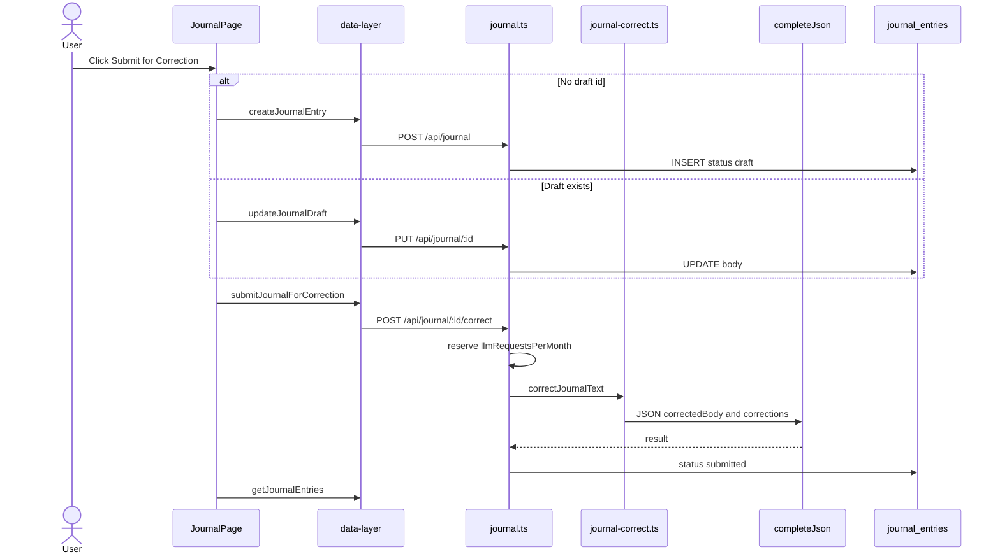

# Journal domain

This domain stores text that the learner writes in the target language. Correction uses the large language model (LLM) of the Tutor. The page does not translate English into the target language. The user writes in the target language. The tutor returns a corrected body.

## Submit journal for correction

**App domain:** Journal

The user writes an entry and clicks Submit for Correction.

### Path

### Key files

| Role | Path | Function |
| --- | --- | --- |
| Page | `src/app/journal/page.tsx` | `handleSubmit` |
| Modal | `src/app/journal/components/EntryModal.tsx` | `EntryModal` |
| View | `src/app/journal/components/CorrectionView.tsx` | `CorrectionView` |
| Highlights | `src/app/journal/components/HighlightedText.tsx` | `HighlightedText` |
| Client | `src/lib/data-layer.ts` | `createJournalEntry`, `updateJournalDraft`, `submitJournalForCorrection` |
| API | `api/src/routes/journal.ts` | `POST /`, `PUT /:id`, `POST /:id/correct` |
| Shared LLM | `api/src/lib/journal-correct.ts` | `correctJournalText` |
| JSON | `api/src/lib/llm/complete-json.ts` | `completeJson` |
| Provider | `api/src/lib/llm/index.ts` | `getProvider` |

`POST /api/journal-correct` runs the same `correctJournalText` with no row write. The journal page does not call it.

### Branches

- If the textarea is empty, the page disables Submit.
- Empty body on the API returns 400.
- The user cannot change the body of a submitted entry. PUT returns 400.
- PUT and POST-correct omit `language` from the client. The API uses `targetLanguage` from settings. If the user switches language after create, the same id can 404.
- Plan 429 on create or update shows the plan toast. The page does not set a local error.
- LLM failure refunds `llmRequestsPerMonth` and returns 500.
- If the text is perfect, the row still stores `status = 'submitted'`. The `corrections` array is empty.
- The Free plan has a managed LLM allowance of 0. Bring-your-own-key (BYOK) uses the user key.

### Tables

`journal_entries`, `usage_counters`, `settings` (`targetLanguage`), `user_provider_credentials` for BYOK.

### Tests

`e2e/journal.spec.ts`. The full-journey case saves a draft. It does not click Submit.

## Save journal draft

**App domain:** Journal

Save Draft writes the row without an LLM call. After the first create, a 3 second timer also writes the draft.

| Role | Path | Function |
| --- | --- | --- |
| Page | `src/app/journal/page.tsx` | `handleSaveDraft`, `handleBodyChange` |
| Client | `src/lib/data-layer.ts` | `createJournalEntry`, `updateJournalDraft` |
| API | `api/src/routes/journal.ts` | `POST /`, `PUT /:id` |

Meters: `maxJournalEntries`, `journalWordsPerMonth`, row caps, and total byte caps. An update meters growth only. Shrink of a draft does not refund the month.

## View history

**App domain:** Journal

| Role | Path | Function |
| --- | --- | --- |
| Page | `src/app/journal/page.tsx` | `getJournalEntries(50)` |
| Card | `src/app/journal/components/HistoryCard.tsx` | `HistoryCard` |
| API | `api/src/routes/journal.ts` | `GET /`, `GET /:id`, `DELETE /:id` |

A draft card reopens the editor. A submitted card opens `EntryModal` with `CorrectionView`.
