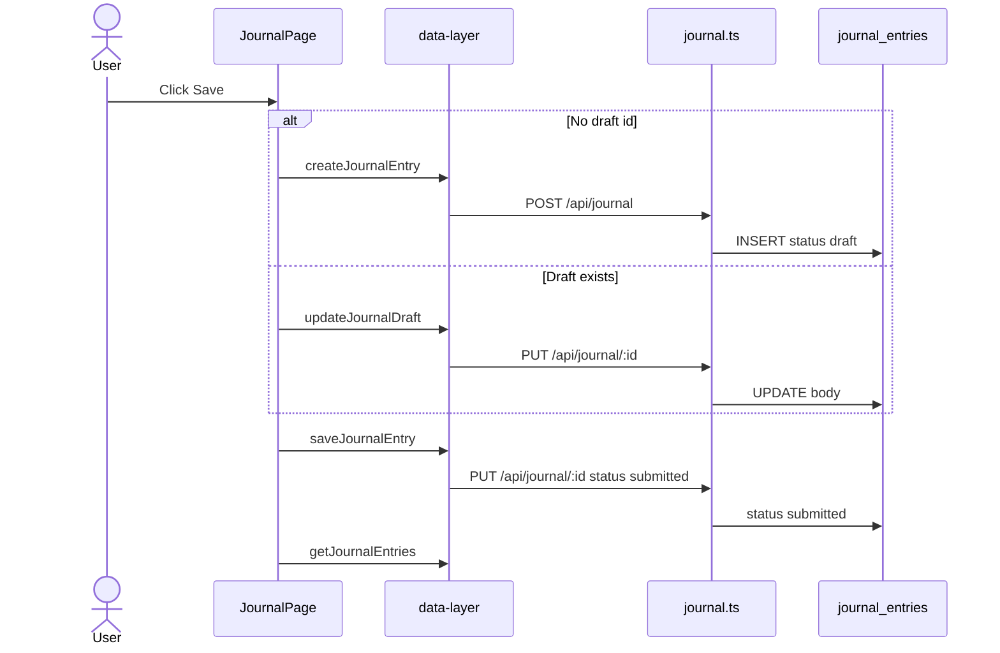
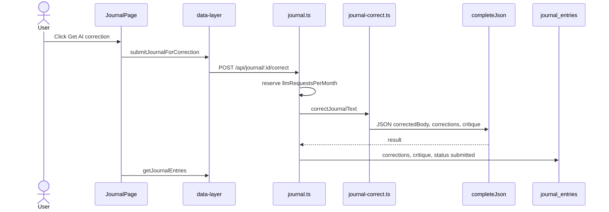

# Journal domain

This domain stores text that the learner writes in the target language. The page is a log of text first. Correction uses the large language model (LLM) of the Tutor. Correction is optional. The page does not translate English into the target language.

## Save a journal entry

**App domain:** Journal

The user writes an entry and clicks Save. The client writes the body and sets status to `submitted`. The client does not call `/correct`.

### Path

### Key files

| Role | Path | Function |
| --- | --- | --- |
| Page | `src/app/journal/page.tsx` | `handleSave` |
| Notebook | `src/app/journal/components/NotebookPage.tsx` | `NotebookPage` |
| Client | `src/lib/data-layer.ts` | `createJournalEntry`, `updateJournalDraft`, `saveJournalEntry` |
| API | `api/src/routes/journal.ts` | `POST /`, `PUT /:id` |

### Branches

- If the textarea is empty, the page disables Save.
- When the client sends no text, the API returns 400.
- The user cannot change the body of a submitted entry. PUT returns 400.
- PUT can set `status` to `submitted` on a draft. That write does not call the model.
- Plan 429 on create or update shows the plan toast. The page does not set a local error.

## Save journal draft

**App domain:** Journal

Save Draft writes the row without an LLM call. After the first create, a 3 second timer also writes the draft. A draft does not add to the word-count totals.

| Role | Path | Function |
| --- | --- | --- |
| Page | `src/app/journal/page.tsx` | `handleSaveDraft`, `handleBodyChange` |
| Client | `src/lib/data-layer.ts` | `createJournalEntry`, `updateJournalDraft` |
| API | `api/src/routes/journal.ts` | `POST /`, `PUT /:id` |

Meters: `maxJournalEntries`, `journalWordsPerMonth`, row caps, and total byte caps. An update meters growth only. Shrink of a draft does not refund the month.

## Ask for a correction

**App domain:** Journal

The user opens a submitted entry. If `corrections` is `null`, the page shows the original text and a `Get AI correction` button. That button calls `POST /api/journal/:id/correct`.

### Path

### Key files

| Role | Path | Function |
| --- | --- | --- |
| Page | `src/app/journal/page.tsx` | `handleCorrect` |
| View | `src/app/journal/components/CorrectionView.tsx` | `CorrectionView` |
| Critique | `src/app/journal/components/CritiquePanel.tsx` | `CritiquePanel` |
| Client | `src/lib/data-layer.ts` | `submitJournalForCorrection` |
| API | `api/src/routes/journal.ts` | `POST /:id/correct` |
| Shared LLM | `api/src/lib/journal-correct.ts` | `correctJournalText` |

`null` on `corrections` means no run yet. An empty array means the model found no errors. A second run on an entry that already has a result returns 400.

If the plan refuses the LLM call, the plan-limit toast shows. The entry stays submitted. The body does not change.

If the text is perfect, the row still stores `status = 'submitted'`. The `corrections` array is empty. The critique can still list strengths.

The Free plan has a managed LLM allowance of 0. Bring-your-own-key (BYOK) uses the user key.

## Add a revision

**App domain:** Journal

After a correction, the learner can write a revision. The revision is new text. It is not a new model call.

| Role | Path | Function |
| --- | --- | --- |
| Page | `src/app/journal/page.tsx` | `handleSaveRevision` |
| Panel | `src/app/journal/components/RevisionPanel.tsx` | `RevisionPanel` |
| Client | `src/lib/data-layer.ts` | `updateJournalRevision` |
| API | `api/src/routes/journal.ts` | `PUT /:id` with `revision` |

When `corrections` is still `null`, PUT rejects a revision.

## Word counts

**App domain:** Journal

`GET /api/journal/stats` sums `wordCount` for submitted entries in the open language. Drafts are out of the total.

The Journal page shows a count for this month, this year, and all time. The Stats page shows the same three figures.

| Role | Path | Function |
| --- | --- | --- |
| Page | `src/app/journal/page.tsx` | `getJournalWordStats` |
| Bar | `src/app/journal/components/WordCountBar.tsx` | `WordCountBar` |
| Stats | `src/app/stats/page.tsx` | journal word cards |
| API | `api/src/routes/journal.ts` | `GET /stats` |

## View history

**App domain:** Journal

The list on the side shows past entries. The notebook shows one entry. Older and Newer move through the list.

| Role | Path | Function |
| --- | --- | --- |
| Page | `src/app/journal/page.tsx` | `getJournalEntries(200)` |
| Sidebar | `src/app/journal/components/EntrySidebar.tsx` | `EntrySidebar` |
| API | `api/src/routes/journal.ts` | `GET /`, `GET /:id`, `DELETE /:id` |

A draft page opens the editor. A submitted page shows the original text. After a correction run, the page also has Corrections, Critique, and Revision faces.

### Tables

`journal_entries`, `usage_counters`, `settings` (`targetLanguage`), `user_provider_credentials` for BYOK.

### Tests

`e2e/journal.spec.ts`. `api/src/routes/journal.test.ts`. `src/app/journal/utils.test.ts`.
