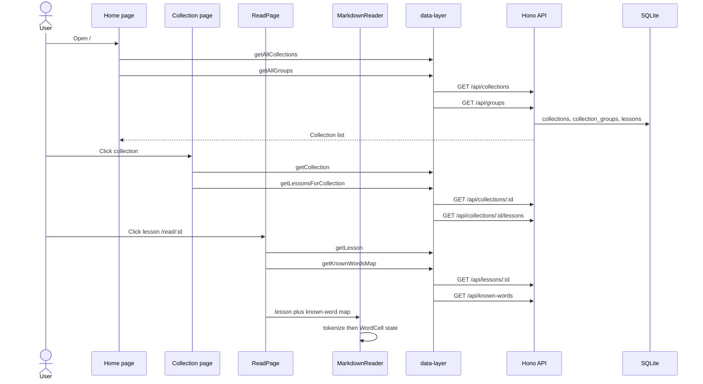
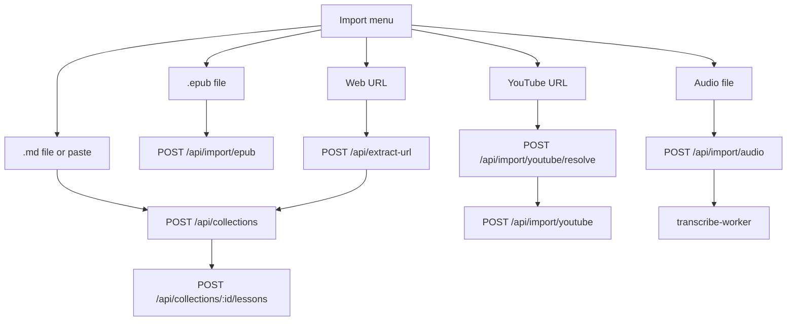

# Library domain

This domain holds collections, groups, lessons, and import. Word colour in the reader comes from the Vocabulary domain. A tap of a word is the Translation domain.

## Load library item

**App domain:** Library

The user opens the library, opens a collection, then opens a lesson. The reader paints each word with a state from the known-word map.

### Path

### Key files

| Role | Path | Function |
| --- | --- | --- |
| Library page | `src/app/(index)/page.tsx` | `loadData` |
| Collection page | `src/app/collection/[id]/page.tsx` | `load` |
| Reader page | `src/app/read/[bookId]/page.tsx` | `loadLesson` |
| Reader shell | `src/components/MarkdownReader/index.tsx` | `makeWordSegmentation` |
| Markdown blocks | `src/components/MarkdownReader/ReaderArticle.tsx` | `ReaderBlock` |
| Word colour | `src/components/WordCell/index.tsx` | `onActivate` |
| Client | `src/lib/data-layer.ts` | `getAllCollections`, `getCollection`, `getLessonsForCollection`, `getLesson`, `getKnownWordsMap` |
| API | `api/src/routes/collections.ts` | `GET /`, `GET /:id`, `GET /:id/lessons` |
| API | `api/src/routes/lessons.ts` | `GET /:id` |
| API | `api/src/routes/known-words.ts` | `GET /` |
| Tokenize | `languages/tokenizer/index.ts` | `tokenize` |

### Branches

- If `transcriptionStatus` is `pending` or `processing`, the page polls `getLesson` every 4 seconds.
- If `transcriptionStatus` is `error`, the user can retry with `POST /api/lessons/:id/retry-transcription`.
- If `sourceType` is `youtube`, the reader uses `YouTubePlayer` and `TranscriptReader`.
- If listen mode is on and audio segments exist, the reader uses `ListenAlong`.
- Else the reader uses `ReaderArticle`.
- The pack is the lesson language, not the UI language.
- A lesson in CJK stores tokens in `lessons.segmentWords`. The reader uses longest match. If that fails, it uses `Intl.Segmenter`.
- Spaced languages use the regex tokenizer. `segmentWords` is null.
- If the collection does not exist, the app sends the user back to `/`.
- If the lesson id is for another language, `resolveLanguage` returns 404.

### Tables

`collections`, `collection_groups`, `lessons`, `knownWords`. Audio lessons also use `transcript_segments`.

### Tests

`e2e/collections.spec.ts`, `e2e/reader-markdown.spec.ts`, `e2e/groups.spec.ts`.

## Collection groups

**App domain:** Library

A group is a folder of collections. The home page lists groups first.

| Role | Path | Function |
| --- | --- | --- |
| Library page | `src/app/(index)/page.tsx` | `loadData` |
| Client | `src/lib/data-layer.ts` | `getAllGroups` |
| API | `api/src/routes/groups.ts` | `GET /`, `POST /`, `PUT /:id`, `DELETE /:id` |

`collection_groups` is language-agnostic. Import can target a group through `importGroupId`.

## Lesson progress

**App domain:** Library

Scroll in the reader writes progress. `progressWriter` waits 1 second between writes.

| Role | Path | Function |
| --- | --- | --- |
| Reader | `src/components/MarkdownReader/index.tsx` | `progressWriter`, `handleScroll` |
| Client | `src/lib/data-layer.ts` | `updateLessonProgress` |
| API | `api/src/routes/lessons.ts` | `PUT /:id/progress` |

The route updates `lessons.progress_scrollPosition`, `progress_percentComplete`, and `lastReadAt`. It also bumps `collections.lastReadAt`. Continue Reading uses a lesson under 95 percent complete.

## Import

**App domain:** Library

The Import menu on the home page is the entry. Destination group is `importGroupId` on `src/app/(index)/page.tsx`.

### EPUB

| Role | Path | Function |
| --- | --- | --- |
| Home | `src/app/(index)/page.tsx` | `handleFileChange` |
| Client | `src/lib/data-layer.ts` | `importEpub` |
| API | `api/src/routes/import.ts` | `POST /epub` |
| Parser | `api/src/lib/epub-parser.ts` | `parseEpub` |

One collection, one lesson per chapter. Caps: 50 MB body, 100 MB uncompressed.

### Paste and markdown

| Role | Path | Function |
| --- | --- | --- |
| Modal | `src/components/PasteImportModal/index.tsx` | `handleSave` |
| Client | `src/lib/data-layer.ts` | `createStandaloneLesson`, `addLessonToCollection` |
| API | `api/src/routes/collections.ts` | `POST /`, `POST /:id/lessons` |
| Words | `api/src/lib/html-to-markdown.ts` | `countWords`, `buildSegmentWords` |

`createStandaloneLesson` creates a collection, then a lesson. If the lesson write fails, the client deletes the collection.

### Web URL

| Role | Path | Function |
| --- | --- | --- |
| Modal | `src/components/WebImportModal/index.tsx` | `handleExtract`, `handleSave` |
| Client | `src/components/WebImportModal/utils.ts` | `extractArticle` |
| API | `api/src/routes/extract-url.ts` | `POST /` |
| Fetch | `api/src/lib/safe-fetch.ts` | `safeFetch` |

Mozilla Readability extracts the article. Then the paste path stores it. Fail codes: `INVALID_URL`, `FETCH_FAILED`, `NO_CONTENT`, `rate_limited`.

### YouTube transcript

| Role | Path | Function |
| --- | --- | --- |
| Modal | `src/components/YouTubeImportModal/index.tsx` | `handleResolve`, `handleImport` |
| Client | `src/lib/data-layer.ts` | `resolveYouTubeTranscript`, `importYouTubeTranscript` |
| API | `api/src/routes/youtube-import.ts` | `POST /resolve`, `POST /` |
| Transcript | `api/src/lib/youtube-transcript.ts` | `parseJson3Transcript` |

The lesson stores `sourceType = 'youtube'`, `sourceMeta`, and caption `segments` as JSON. This is not `transcript_segments`. The reader uses the YouTube iframe, not Listen-along.

### Audio

| Role | Path | Function |
| --- | --- | --- |
| Home | `src/app/(index)/page.tsx` | `handleAudioFileChange` |
| Client | `src/lib/data-layer.ts` | `importAudio` |
| API | `api/src/routes/import.ts` | `POST /audio` |
| Worker | `api/src/lib/transcribe-worker.ts` | `transcribeNextPending`, `applyTranscript` |

The lesson starts with `transcriptionStatus = 'pending'`. The worker needs `TRANSCRIBE_WORKER=1`. After three ASR failures the status is `error`.

### Starter texts

See [Onboarding](onboarding.md). Seed is `POST /api/starter/seed`.
