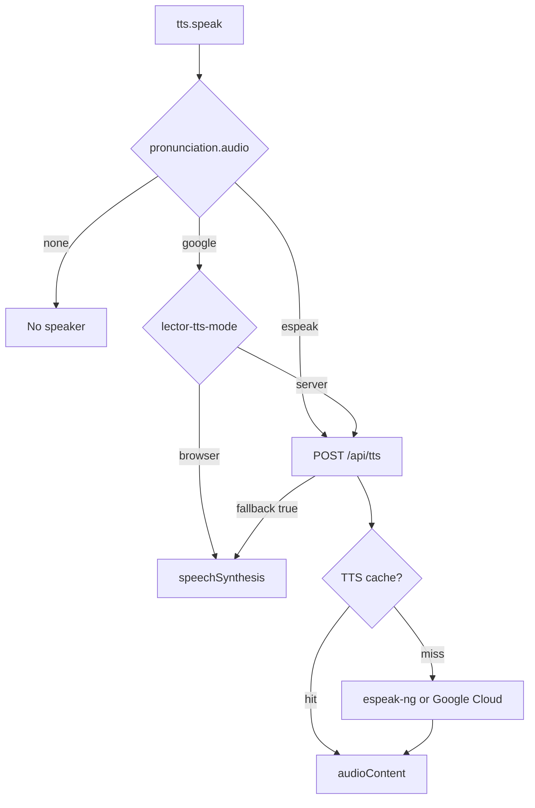
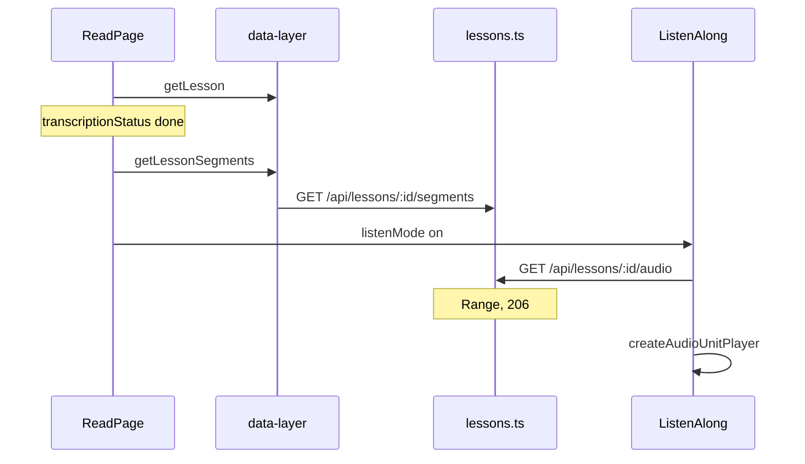

# Listen domain

This domain is speech and audio lessons. YouTube captions share the Reader. They do not share the podcast player.

## Speak word

**App domain:** Listen

The drawer, the reader tap, and practice call `speak`.

### Key files

| Role | Path | Function |
| --- | --- | --- |
| Client | `src/lib/tts.ts` | `speak`, `speakWithServer`, `speakWithBrowser`, `hasAudio` |
| Settings | `src/app/settings/components/TTSSettings/index.tsx` | `TTSSettings` |
| API | `api/src/routes/tts.ts` | `POST /` |
| Cache | `api/src/lib/tts-cache.ts` | `getTtsCache`, `ttsCacheKey` |

Mode lives in `localStorage` key `lector-tts-mode`. Cloud Free with `ttsCharsPerMonth === 0` forces browser mode. A Google miss or absent key returns `{ fallback: true }`. Esperanto eSpeak does not fall back to the browser.

### Tables

No audio blob table. Meter is `usage_counters` for Google characters.

## Listen-along

**App domain:** Listen

Podcast import is the Library domain. Playback is this domain.

| Role | Path | Function |
| --- | --- | --- |
| Reader | `src/app/read/[bookId]/page.tsx` | listen mode toggle |
| Player | `src/components/ListenAlong/index.tsx` | `ListenAlong` |
| Units | `src/components/ListenAlong/drill-player.ts` | `createAudioUnitPlayer` |
| Client | `src/lib/data-layer.ts` | `getLessonSegments`, `lessonAudioUrl` |
| API | `api/src/routes/lessons.ts` | `GET /:id/segments`, `GET /:id/audio` |
| Worker | `api/src/lib/transcribe-worker.ts` | `applyTranscript` |

Word tap pauses and opens the Translation drawer. Shadow mode repeats a unit.

Tables: `lessons`, `transcript_segments`. Files under `AUDIO_DIR`.

Tests: `e2e/audio-import.spec.ts`.

## YouTube captions

**App domain:** Listen. Import is the Library domain.

| Role | Path | Function |
| --- | --- | --- |
| Reader | `src/components/MarkdownReader/index.tsx` | youtube branch |
| Player | `src/components/YouTubePlayer/index.tsx` | `seekTo` |
| Cues | `src/components/MarkdownReader/TranscriptReader.tsx` | `onSeek`, `onWordClick` |

Cues live on `lessons.segments` JSON, not `transcript_segments`. Listen-along does not mount.

Tests: `e2e/youtube-transcript.spec.ts`.
