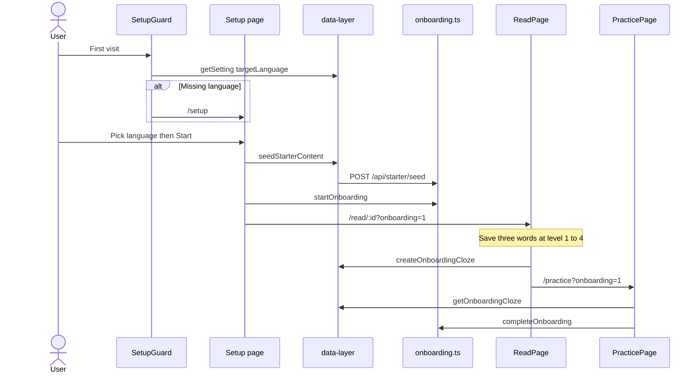
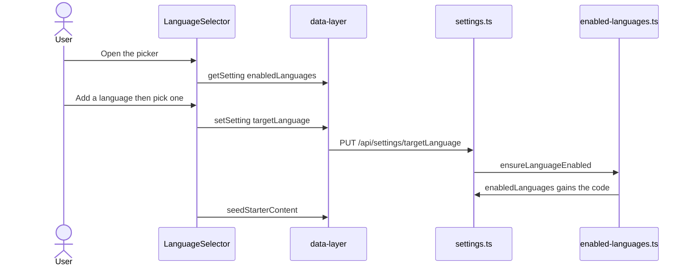

# Onboarding domain

Onboarding is the product name for first-run setup. This domain picks a language and seeds starter texts. It then runs a short guided lesson. It also creates 3 cloze cards.

## Language setup

**App domain:** Onboarding

### Key files

| Role | Path | Function |
| --- | --- | --- |
| Guard | `src/components/SetupGuard/index.tsx` | `SetupGuard` |
| Setup | `src/app/setup/page.tsx` | `handleContinue` |
| Client | `src/lib/onboarding.ts` | `getOnboardingSnapshot`, `startOnboarding`, `skipOnboarding`, `completeOnboarding`, `recordLearnerEvent` |
| Starter client | `src/lib/data-layer.ts` | `seedStarterContent`, `getStarterStatus`, `createOnboardingCloze`, `getOnboardingCloze` |
| Coach | `src/components/OnboardingCoach/index.tsx` | `OnboardingCoach` |
| API | `api/src/routes/onboarding.ts` | `GET /`, `POST /start`, `POST /skip`, `PATCH /`, `POST /complete` |
| Starter API | `api/src/routes/starter.ts` | `GET /status`, `POST /seed` |
| Cloze | `api/src/routes/cloze.ts` | `POST /onboarding`, `GET /onboarding` |
| Content | `api/src/lib/starter-content.ts` | `loadStarterContent`, `hasStarterContent` |
| Packs | `languages/<code>/content/starter/` | markdown plus `manifest.json` |

### Branches

- Skip to library records `skipped` and does not run the guided lesson.
- Seed is once per user and language (`settings` key `starterSeeded:{lang}`). Delete of starter does not re-seed.
- Other collections in that language return `library-not-empty`.
- Phrase saves do not create cloze cards for Onboarding.
- Practice needs 3 words that the user saved. It also needs 3 cards. Else the page shows a recovery empty state.
- Cloud `AuthGuard` runs before `SetupGuard`.

### Tables

`settings`, `learner_profiles`, `onboarding_progress`, `learner_events`, `collections`, `lessons`, `clozeSentences`, `vocab`.

### Tests

`e2e/onboarding.spec.ts`, `e2e/language-setup.spec.ts`, `e2e/starter-content.spec.ts`.

## Add a language

**App domain:** Onboarding

The picker lists only the languages that the account opted into. **Add a language** expands the rest of the registry inside the same menu. A selection there switches to that language, and the API opts the account in on the write.

### Key files

| Role | Path | Function |
| --- | --- | --- |
| Picker | `src/components/LanguageSelector/index.tsx` | `LanguageSelector` |
| Settings | `src/app/settings/components/LanguagesSettings/index.tsx` | `LanguagesSettings` |
| Hook | `src/utils/hooks.ts` | `useEnabledLanguages` |
| Shared list | `languages/enabled.ts` | `normalizeEnabledLanguages`, `availableLanguages` |
| API | `api/src/lib/enabled-languages.ts` | `readEnabledLanguages`, `ensureLanguageEnabled` |
| Backfill | `api/src/db.ts` | `migrateEnabledLanguages` |

### Branches

- Every writer of `targetLanguage` opts the account in. Onboarding, the picker and a restore all take that path.
- The active language is always listed, whatever the stored list holds.
- Settings, then Languages, adds a language without a switch.
- The same section removes a language from the list.
- Remove keeps the words, texts and cards of that language.
- An account from before this flow gets a list at boot. The list holds its target language plus every language its rows carry.

### Tables

`settings`.

### Tests

`e2e/language-opt-in.spec.ts`, `api/src/db-enabled-languages.test.ts`, `api/src/routes/settings.test.ts`, `languages/enabled.test.ts`.
