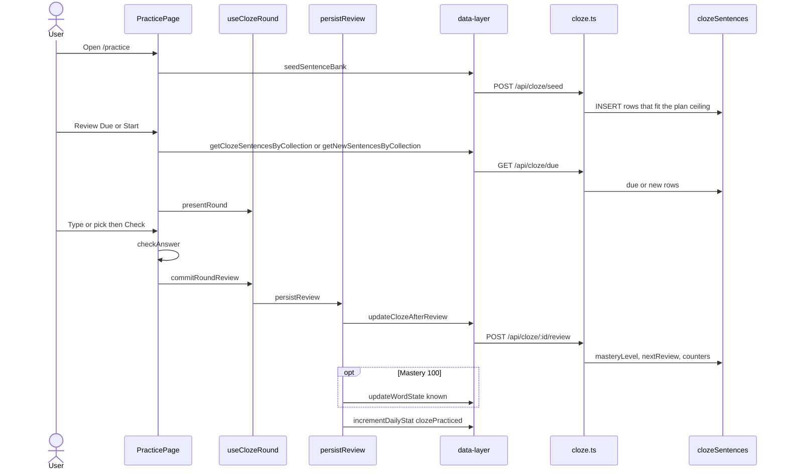

# Practice domain

This domain runs cloze and dictation with spaced repetition (SRS). Cards live in `clozeSentences`. Mastery 100 also writes the Vocabulary domain.

Intervals in days come from `calculateNextReview`:

| Mastery | Days |
| --- | --- |
| 0 | 0 |
| 25 | 1 |
| 50 | 3 |
| 75 | 7 |
| 100 | 14 |

A correct answer adds 25, cap 100. A miss sets mastery to 0 and re-queues the card in the same round. Retry awards no points. When a mastery 100 card is due, it still appears.

## Practice word

**App domain:** Practice

The user opens `/practice`, picks a collection, then reviews due cards or learns new cards.

### Path

### Key files

| Role | Path | Function |
| --- | --- | --- |
| Page | `src/app/practice/page.tsx` | `startRoundWith`, `handleSubmit`, `handleMcSelect`, `recordAnswer` |
| Round | `src/app/practice/use-cloze-round.ts` | `useClozeRound`, `clozeRoundReducer`, `commitRoundReview` |
| Persist | `src/app/practice/persist-review.ts` | `persistReview` |
| Grade | `src/app/practice/utils.ts` | `checkAnswer`, `normalize`, `calculateNextReview`, `calculatePoints`, `createBlankedSentence`, `buildMultipleChoiceOptions` |
| Feedback | `src/app/practice/components/Feedback/index.tsx` | `Feedback` |
| Client | `src/lib/data-layer.ts` | `seedSentenceBank`, `getClozeSentencesByCollection`, `getNewSentencesByCollection`, `updateClozeAfterReview` |
| API | `api/src/routes/cloze.ts` | `POST /seed`, `GET /due`, `GET /counts`, `POST /:id/review` |
| Bank | `api/src/lib/sentence-bank-*.json` | `loadSentenceBank` |
| Tokens | `api/src/lib/languages.ts` | `resolveClozeTokens` |
| Punct | `src/lib/words.ts` | `splitTrailingPunctuation` |

`GET /due` modes:

- `mode=new`: `reviewCount = 0`
- `mode=review`: `nextReview <= now` and `reviewCount > 0`. This includes mastery 100.
- else: `nextReview <= now`

Blacklisted rows stay out. Order is random.

### Branches

- The Type or MC mode lives in `localStorage` key `cloze-practice-mode`.
- Type mode can fall back to MC mode for one card. The next card returns to type.
- If `persistReview` fails, the round does not advance.
- Word-state and daily-stat writes are best effort after a saved review.
- Punctuation after the word sits outside the blank. The grade step strips it. The known-word write also strips it.
- The seed step copies rows from Tatoeba in the JSON bank. The seed step also copies mined rows. A Free plan copies only the rows that fit the practice ceiling.
- Live `GET /api/tatoeba` is not on this path.
- The UI collections are:
  - `top500`
  - `top1000`
  - `top2000`
- Collection `mined` is for Onboarding only.

### Tables

`clozeSentences`, `knownWords` at mastery 100, and `dailyStats`.

### Tests

`e2e/practice.spec.ts`, `e2e/mc-fallback.spec.ts`, `e2e/cloze-definitions.spec.ts`. Unit: `src/app/practice/__tests__/use-cloze-round.test.ts`, `persist-review.test.ts`.

## Dictation

**App domain:** Practice

Same SRS persist. The user types the full sentence after TTS.

| Role | Path | Function |
| --- | --- | --- |
| Page | `src/app/practice/page.tsx` | `recordDictation`, `handleSetPracticeFormat` |
| Card | `src/app/practice/components/Dictation/DictationCard.tsx` | `DictationCard` |
| Grade | `src/app/practice/utils.ts` | `diffDictation`, `scoreDictation`, `calculateDictationPoints` |
| Speech | `src/lib/tts.ts` | `speak`, `hasAudio` |

Pass threshold is 0.75. Surrender is always a miss. A pack with `pronunciation.audio: 'none'` hides Dictation.

Tests: `e2e/dictation.spec.ts`.

## Blacklist sentence

**App domain:** Practice

| Role | Path | Function |
| --- | --- | --- |
| Button | `src/app/practice/components/BlacklistSentence/index.tsx` | `handleBlacklist`, `handleUndoBlacklist` |
| Round | `src/app/practice/use-cloze-round.ts` | `blacklistCurrent` |
| Client | `src/lib/data-layer.ts` | `blacklistClozeSentence`, `unblacklistClozeSentence` |
| API | `api/src/routes/cloze.ts` | `PUT /:id` `{ blacklisted }` |

The row stays in the table. Due queries exclude it. Undo does not put the card back in the current round.

## Onboarding cloze

See [Onboarding](onboarding.md). Cards use `source = 'mined'`, `collection = 'mined'`, id `onboarding:{vocabId}`.
