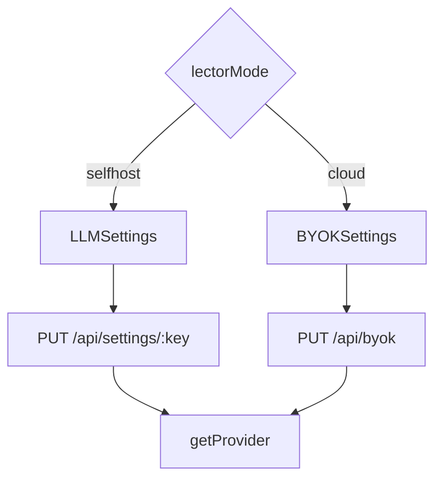

# Settings domain

This domain holds user keys, the LLM provider, personal access tokens, and account delete. Plan tiles live in [Billing](billing.md). Known-word import lives in [Vocabulary](vocabulary.md).

## Save settings

**App domain:** Settings

The settings page writes one key at a time.

| Role | Path | Function |
| --- | --- | --- |
| Page | `src/app/settings/page.tsx` | Settings page |
| Client | `src/lib/data-layer.ts` | `getSetting`, `setSetting`, `deleteSetting` |
| API | `api/src/routes/settings.ts` | `GET /:key`, `PUT /:key`, `DELETE /:key` |
| Keys | `api/src/lib/settings-keys.ts` | `validateSettingWrite` |

The `settings` table stores JSON values. Secret keys return a redaction sentinel on read.

### Branches

- Theme and timezone write the same table.
- Practice settings write cloze and dictation keys.
- TTS settings write voice keys. See [Listen](listen.md).
- Anki settings write the AnkiConnect URL. See [Anki](anki.md).

## Configure LLM

**App domain:** Settings

Selfhost uses `LLMSettings`. Cloud uses `BYOKSettings`. `getProvider` reads the same keys on the API.

| Role | Path | Function |
| --- | --- | --- |
| Selfhost UI | `src/app/settings/components/LLMSettings/index.tsx` | LLMSettings |
| Cloud UI | `src/app/settings/components/BYOKSettings.tsx` | BYOKSettings |
| Status | `api/src/routes/llm-status.ts` | `GET /` |
| BYOK API | `api/src/routes/byok.ts` | `GET /`, `PUT /`, `DELETE /` |
| Crypto | `api/src/lib/byok.ts` | `saveByokCredential`, `getByokCredential` |
| Provider | `api/src/lib/llm/index.ts` | `getProvider` |

### Branches

- Selfhost stores the endpoint in `settings`. It also stores the model and the key.
- Cloud stores the user key in `user_provider_credentials`. The server encrypts the secret.
- A valid BYOK key raises AI abuse caps. Product caps stay on the plan.
- OpenAI-compatible presets only fill the URL. The API sees one provider.

## API tokens

**App domain:** Settings

A personal access token lets a CLI or script call the API.

| Role | Path | Function |
| --- | --- | --- |
| UI | `src/app/settings/components/APITokens/index.tsx` | APITokens |
| Client | `src/lib/data-layer.ts` | `createApiToken`, `getApiTokens`, `revokeApiToken` |
| API | `api/src/routes/tokens.ts` | `POST /`, `GET /`, `DELETE /:id` |

The raw token shows once. The table stores a hash. Scope `*` is the default.

## Delete account

**App domain:** Settings

Cloud only. The user types `DELETE`. Better Auth sends a confirm email. The click erases the tenant data. Erasure keeps the product-mail opt-out row. That row stores a hash of the address.

| Role | Path | Function |
| --- | --- | --- |
| UI | `src/app/settings/components/DeleteAccount/index.tsx` | `handleDelete` |
| Client | `src/lib/auth-client.ts` | `authClient.deleteUser` |
| Engine | `api/src/lib/accounts.ts` | delete-user confirmation mail |

Selfhost has one implicit user. The card does not render.

### Tables

`settings`, `user_provider_credentials`, `api_tokens`.
