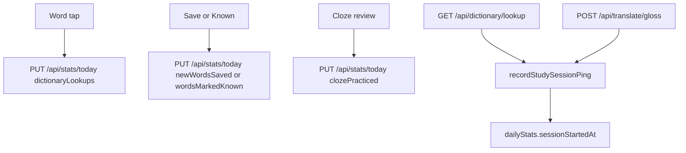
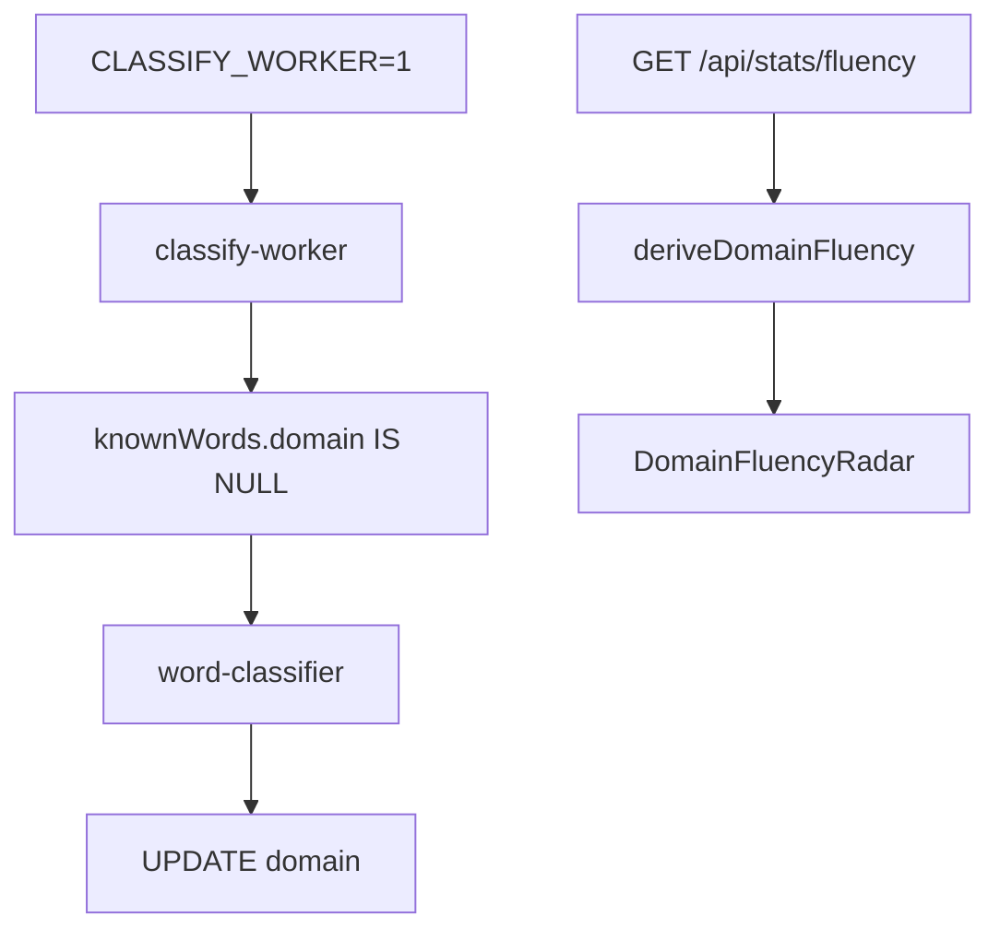

# Stats domain

This domain counts activity for the day, streaks, and fluency. Topic domains on the radar are not app domains. See `api/src/lib/domains.ts`.

## Daily stats

**App domain:** Stats

| Role | Path | Function |
| --- | --- | --- |
| Client | `src/lib/data-layer.ts` | `incrementDailyStat`, `getTodayStats`, `getStreak`, `getFluencyStats` |
| Dates | `src/lib/dates.ts` and `api/src/lib/dates.ts` | `getTodayDate` |
| Streak | `src/lib/streak.ts` and `api/src/lib/streak.ts` | `computeStreaks` |
| API | `api/src/routes/stats.ts` | `GET /today`, `PUT /today`, `GET /streak`, `GET /fluency` |
| Ping | `api/src/lib/study-session.ts` | `recordStudySessionPing` |
| Ping route | `api/src/routes/study-ping.ts` | `GET /`, `POST /` |

If a day has dictionary lookups, cloze practice, or read minutes, the day is active. Do not compute a streak on a page.

The web client does not write `minutesRead`. `api/src/lib/stats-derive.ts` estimates read minutes from lesson progress.

`POST /api/study-ping` is for scripts. The UI does not call it. Dictionary and translate routes stamp the session on the server.

### Tables

`dailyStats` on `(userId, date, language)`.

### Tests

`e2e/stats.spec.ts`, `e2e/activity-heatmap.spec.ts`, `e2e/fluency.spec.ts`.

## Fluency radar

**App domain:** Stats

The classifier is a background worker. It is not on the tap path.

| Role | Path | Function |
| --- | --- | --- |
| Stats page | `src/app/stats/page.tsx` | `getFluencyStats` |
| Radar | `src/components/DomainFluencyRadar/index.tsx` | `DomainFluencyRadar` |
| Worker | `api/src/lib/classify-worker.ts` | `selectPending`, `applyResults` |
| LLM tags | `api/src/lib/word-classifier.ts` | `classifyWords` |
| Axes | `api/src/lib/domains.ts` | `DOMAINS`, `deriveDomainFluency` |
| API | `api/src/routes/stats.ts` | `GET /fluency` |

The worker classifies only states `level1` to `level4` and `known`. It does not classify `new` or `ignored`. After the worker sets a domain, it does not rewrite it. Invalid output from the LLM stays `NULL` and retries. `general` is valid but is not a radar axis.

### Tables

`knownWords.domain`, `classify_batches`.

Tests: `e2e/domain-fluency-radar.spec.ts`.
