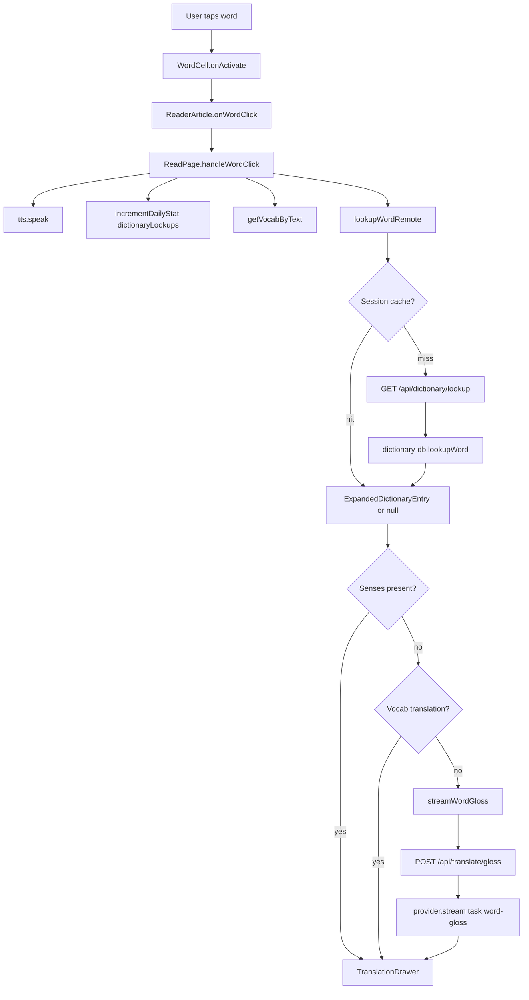
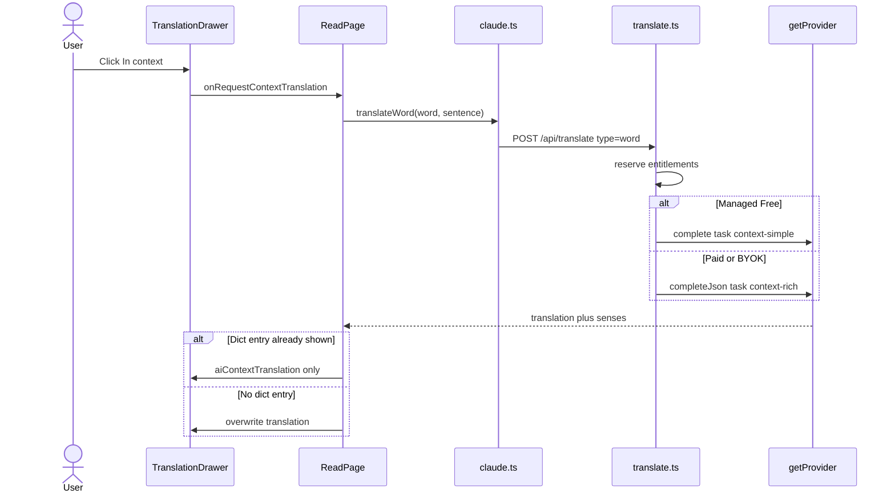
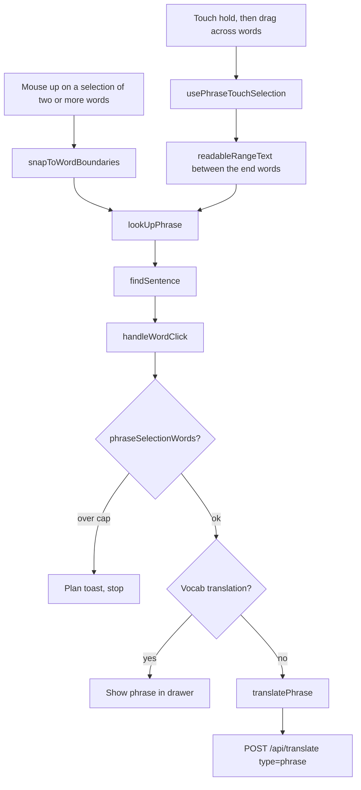
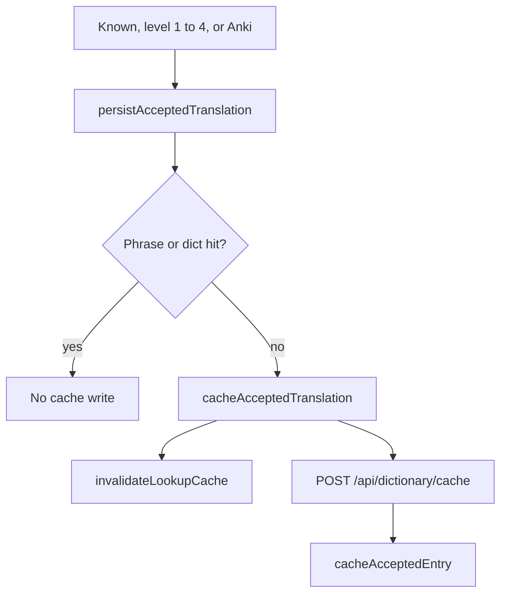

# Translation domain

This domain looks up a word or phrase and shows the drawer. The tap starts in the Reader. Save of the gloss is the Vocabulary domain.

The large language model (LLM) path uses a plan meter. A dictionary hit does not.

## Translate word

**App domain:** Translation

The user taps a word in the reader, a transcript, Listen-along, or a cloze card. The drawer opens at once and shows a load state.

### Path

### Lookup order on the server

`lookupWord` in `api/src/lib/dictionary-db.ts` calls `resolveWord`. Order:

1. Exact key in `dictionary-{lang}.db` `entries`.
2. Inflection table. Then the lemma row.
3. Language rules. Esperanto uses morphology. The Koine-Greek pack (`grc`) folds marks. Afrikaans strips affixes.
4. User cache in `cached_entries`.

If the pack file does not exist, the curated steps skip. Only the user cache can hit.

### Key files

| Role | Path | Function |
| --- | --- | --- |
| Reader page | `src/app/read/[bookId]/page.tsx` | `handleWordClick` |
| Practice page | `src/app/practice/page.tsx` | `handleWordClick` |
| Word tap | `src/components/WordCell/index.tsx` | `onActivate` |
| Sentence | `src/components/MarkdownReader/ReaderArticle.tsx` | `findSentence` |
| Drawer | `src/components/TranslationDrawer/index.tsx` | `TranslationDrawer` |
| Gloss UI | `src/components/TranslationDrawer/components/Gloss/index.tsx` | `Gloss` |
| Dict client | `src/lib/dictionary-client.ts` | `lookupWordRemote` |
| LLM client | `src/lib/claude.ts` | `streamWordGloss`, `translateGloss` |
| Fold | `src/lib/languages.ts` | `foldWord` |
| API dict | `api/src/routes/dictionary.ts` | `GET /lookup` |
| API gloss | `api/src/routes/translate.ts` | `POST /gloss` |
| Dict engine | `api/src/lib/dictionary-db.ts` | `lookupWord`, `resolveWord` |
| Prompt | `api/src/lib/translate-prompts.ts` | `buildGlossPrompt` |
| LLM | `api/src/lib/llm/index.ts` | `getProvider` |

Practice uses `translateGloss`. That is the same `/gloss` route with no stream UI.

### Branches

- A phrase with a space takes the phrase path. See [Phrase selection](#phrase-selection).
- If the user taps again, `translationRequestId` drops stale results.
- A session cache key is `${language}:${foldWord}`. If the user reloads the page, the cache is empty.
- The client does not cache transport errors on lookup.
- Managed Free counts each gloss with `wordGlossesPerMonth` and a burst of 30 per 60 seconds.
- Bring-your-own-key (BYOK) counts gloss with `llmRequestsPerMonth`. There is no burst limit.
- CJK tap uses stored `segmentWords`. Phrase drag needs a space, so it does not apply to unspaced CJK.

### Tables

Curated pack: `data/dictionary-{lang}.db` (`entries`, `senses`, `related_forms`, `inflections`).

User database: `cached_entries`, `cached_senses`, `cached_related_forms`, `vocab`, `dailyStats`, `usage_counters`.

### Tests

`e2e/translation-drawer.spec.ts`, `e2e/reader-streaming-gloss.spec.ts`, `e2e/translation-cache.spec.ts`.

## In-context translation

**App domain:** Translation

The In-context action asks the LLM for a sense that fits the sentence. When the word occurs in that sentence, the drawer shows the control.

### Key files

| Role | Path | Function |
| --- | --- | --- |
| Drawer | `src/components/TranslationDrawer/index.tsx` | `onRequestContextTranslation` |
| Reader | `src/app/read/[bookId]/page.tsx` | `requestContextTranslation` |
| Practice | `src/app/practice/page.tsx` | `requestContextTranslation` |
| Client | `src/lib/claude.ts` | `translateWord` |
| Sentence test | `src/lib/words.ts` | `sentenceContainsWord` |
| API | `api/src/routes/translate.ts` | `POST /` |
| Prompt | `api/src/lib/translate-prompts.ts` | `buildSimpleContextPrompt`, `buildWordEntryPrompt` |

### Branches

- Nested lookup keeps the original sentence. If the nested word is not in that sentence, the drawer hides the In-context action.
- Practice replaces the shown gloss and clears `dictEntry`.
- Managed Free meters `contextTranslationsPerDay` and uses a short prompt.
- Paid and BYOK use `llmRequestsPerMonth` and a rich word entry.
- Managed Free burst for this route is `detail` (10 per 60 seconds).

## Phrase selection

**App domain:** Translation

The user selects two or more words. The reader snaps to word bounds and calls `onWordClick` with the phrase.

A mouse drag makes a browser selection. A touch drag makes none, and it sends no
`mouseup`, so touch input has its own gesture. Hold one word for 350 ms, then
drag across the phrase. Both paths end in `lookUpPhrase`.

| Role | Path | Function |
| --- | --- | --- |
| Reader | `src/components/MarkdownReader/index.tsx` | `handleMouseUp`, `snapToWordBoundaries`, `lookUpPhrase` |
| Reader touch | `src/components/MarkdownReader/usePhraseTouchSelection.ts` | `usePhraseTouchSelection` |
| Reader page | `src/app/read/[bookId]/page.tsx` | `handleWordClick` |
| Client | `src/lib/claude.ts` | `translatePhrase` |
| Limits | `src/lib/plan-limits.ts` | `phraseSelectionLimitPayload` |
| API | `api/src/routes/translate.ts` | `POST /` |
| Prompt | `api/src/lib/translate-prompts.ts` | `buildSimplePhrasePrompt`, `buildPhrasePrompt` |
| Afrikaans rules | `api/src/lib/spelreels.ts` | `getSpelreelsContext` |

Managed Free uses a short phrase prompt and `phraseTranslationsPerDay`. For paid Afrikaans, the prompt adds spelreels from `api/src/lib/afrikaans-spelreels/`. Phrase save does not write the dictionary cache.

Tests: `e2e/reader-phrase-selection.spec.ts`, `e2e/reader-phrase-touch.spec.ts`.

## Enrich and nested lookup

**App domain:** Translation

**Enrich** upgrades a bare gloss to senses, IPA, etymology, and related forms. Free managed allowance for this route is 0.

| Role | Path | Function |
| --- | --- | --- |
| Reader | `src/app/read/[bookId]/page.tsx` | `enrichTranslation` |
| Client | `src/lib/claude.ts` | `enrichWord` |
| API | `api/src/routes/translate.ts` | `POST /enrich` |
| Prompt | `api/src/lib/translate-prompts.ts` | `buildWordEntryPrompt` |

**Nested lookup** follows a form-of link in a gloss.

| Role | Path | Function |
| --- | --- | --- |
| Links | `src/lib/definition-links.ts` | `findNestedWordRef` |
| Button | `src/components/TranslationDrawer/components/NestedWordButton/index.tsx` | `NestedWordButton` |
| Reader | `src/app/read/[bookId]/page.tsx` | `handleNestedLookup` |

`handleNestedLookup` calls `handleWordClick(nestedWord, wordPanel.sentence)`. The call keeps the original sentence. A save after that still records the encounter.

Tests: `e2e/nested-definitions.spec.ts`.

## Cache accepted translation

**App domain:** Translation

When the user marks Known, sets a level, or adds to Anki, the client stores a trusted AI gloss. Next tap can hit `cached_entries` and skip the LLM.

| Role | Path | Function |
| --- | --- | --- |
| Reader | `src/app/read/[bookId]/page.tsx` | `persistAcceptedTranslation` |
| Client | `src/lib/dictionary-client.ts` | `cacheAcceptedTranslation`, `invalidateLookupCache` |
| API | `api/src/routes/dictionary.ts` | `POST /cache` |
| Engine | `api/src/lib/dictionary-db.ts` | `cacheAcceptedEntry` |

Ignore does not write the cache. A cache hit shows the learned pill.

Tests: `e2e/translation-cache.spec.ts`.
