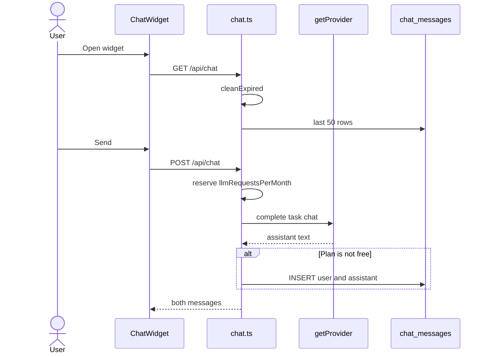
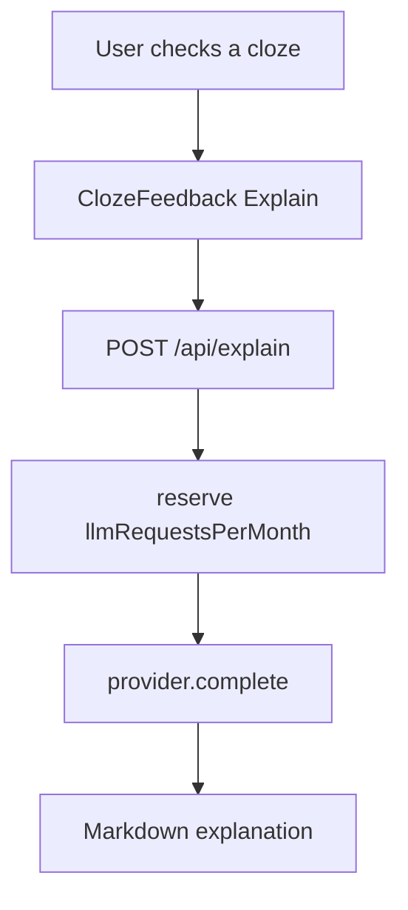

# Tutor domain

This domain is help from a large language model (LLM). It is not a dictionary gloss. Journal correction is the Journal domain. It uses the same `getProvider` stack.

## Tutor chat

**App domain:** Tutor

The Chat widget sits in `src/app/layout.tsx`. Auth routes with no chrome hide it.

### Key files

| Role | Path | Function |
| --- | --- | --- |
| Widget | `src/components/ChatWidget/index.tsx` | `fetchMessages`, `sendMessage`, `clearChat`, `loadMore` |
| Prompts | `src/components/ChatWidget/constants.ts` | `EXAMPLE_PROMPTS` |
| API | `api/src/routes/chat.ts` | `GET /`, `POST /`, `DELETE /` |
| Provider | `api/src/lib/llm/index.ts` | `getProvider` |

The widget calls `apiFetch` itself. The widget does not use `getChatMessages` or `sendChatMessage` in `data-layer.ts`.

### Branches

- If the send is empty, it stays disabled. API returns 400.
- History is per language.
- Free plan does not persist. Free BYOK does not persist. A refresh shows an empty thread.
- Paid history has a 7-day time to live.
- Context is 19 prior rows plus the new message. The route prepends the system prompt into the first user turn so Anthropic works.
- Chat is not in data takeout.

### Tables

`chat_messages`, `usage_counters`.

### Tests

`e2e/chat.spec.ts`, `e2e/chat-language.spec.ts`.

## Cloze Explain

**App domain:** Tutor

After a cloze Check, Explain asks for a prose breakdown of that sentence. Dictation has no Explain.

| Role | Path | Function |
| --- | --- | --- |
| Feedback | `src/app/practice/components/Feedback/index.tsx` | wraps `ClozeFeedback` |
| Button | `src/components/ClozeFeedback/index.tsx` | `handleExplain` |
| API | `api/src/routes/explain.ts` | `POST /` |

The route does not persist the text. Free managed allowance is 0. After a success, the button stays disabled.

Tests: `e2e/explain.spec.ts`.
