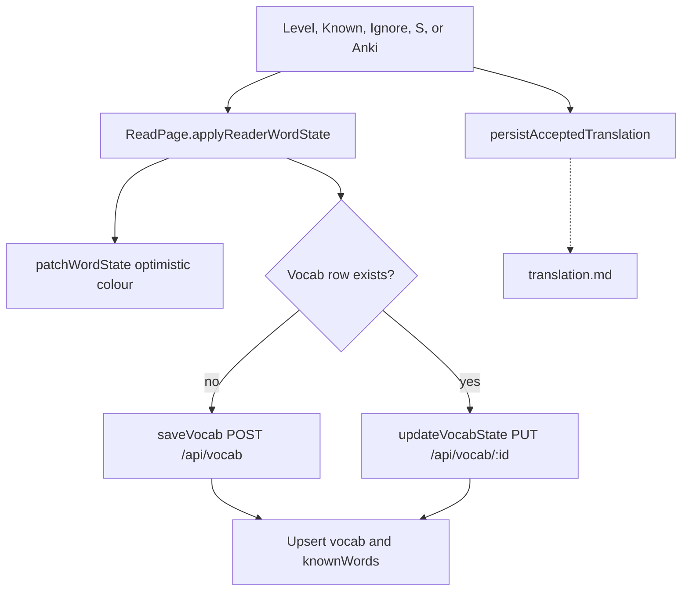

# Vocabulary domain

This domain stores entries that the user owns. It also stores the known-word map. The reader uses `knownWords` for colour. The vocab list uses `vocab`. A save writes both.

## Save vocab and set word state

**App domain:** Vocabulary

There is no Save button. A level, Known, Ignore, keyboard `S`, or Add to Anki creates or updates a row.

Keyboard: `K` marks Known. Keys `1` to `4` set levels. `X` marks Ignore. IME compose skips these keys.

### Key files

| Role | Path | Function |
| --- | --- | --- |
| Reader | `src/app/read/[bookId]/page.tsx` | `setWordLevel`, `markAsKnown`, `ignoreWord`, `saveWordToVocab`, `applyReaderWordState` |
| Colour | `src/components/MarkdownReader/optimistic-word-state.ts` | `patchWordState` |
| Client | `src/lib/data-layer.ts` | `saveVocab`, `updateVocabState`, `getVocabByText` |
| API | `api/src/routes/vocab.ts` | `POST /`, `PUT /:id` |
| Fold | `src/lib/languages.ts` | `foldWord` |

`POST /api/known-words` is not on the drawer path. The reader colours from `GET /api/known-words` at lesson load, then from the optimistic map.

Ignore does not write the translation cache. Known and levels do, for single words with no dict hit. See [translation.md](translation.md#cache-accepted-translation).

Practice mastery 100 calls `updateWordState` in `persistReview`. That is `POST /api/known-words`.

### Word states

`new`, `level1`, `level2`, `level3`, `level4`, `known`, `ignored`.

### Tables

`vocab`, `knownWords`, `dailyStats` (`newWordsSaved`, `wordsMarkedKnown`).

## Vocab list

**App domain:** Vocabulary

| Role | Path | Function |
| --- | --- | --- |
| Page | `src/app/vocab/page.tsx` | `loadData`, `handleUpdateEntry`, `handleDeleteEntry` |
| List | `src/components/VocabList/index.tsx` | `VocabList` |
| Modal | `src/app/vocab/components/VocabDetailModal.tsx` | `handleSave` |
| Client | `src/lib/data-layer.ts` | `getAllVocab`, `updateVocabEntry`, `deleteVocabEntry` |
| API | `api/src/routes/vocab.ts` | `GET /`, `PUT /:id`, `DELETE /:id` |

Filter and page run in memory. `GET /api/vocab` has no `limit`. Delete of the last vocab row for a folded key also deletes `knownWords`.

Tests: `e2e/vocab-edit.spec.ts`, `e2e/vocab-pagination.spec.ts`.

## Known-word import

**App domain:** Vocabulary

Settings, Import Known Words. A plain list writes `knownWords` only. A LingQ CSV also writes `vocab`.

| Role | Path | Function |
| --- | --- | --- |
| UI | `src/app/settings/components/KnownWordsImport/index.tsx` | `importKnownWords`, `importLingQWords` |
| Parse | `src/app/settings/components/KnownWordsImport/utils.ts` | `parseCSVLine`, `lingqStatusToState` |
| Client | `src/lib/data-layer.ts` | `bulkUpdateWordStates`, `saveVocab` |
| API | `api/src/routes/known-words.ts` | `POST /` |

New rows have `domain IS NULL` until the classifier runs. See [stats.md](stats.md).
